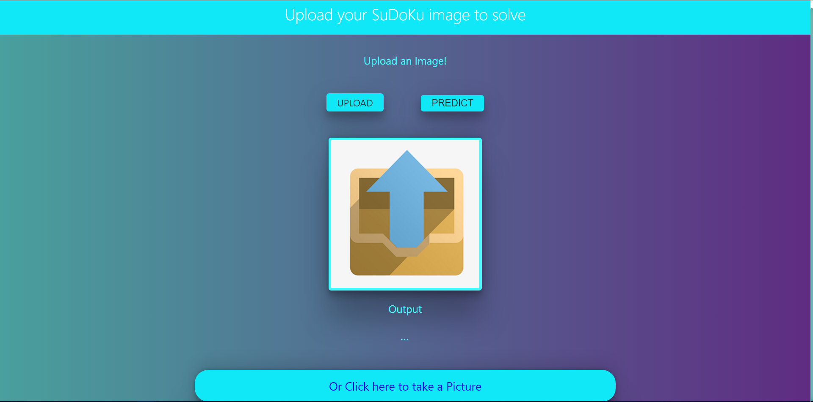

# Sudoku Solver

## About

This application is a Computer Vision Application to detect and solve sudoku puzzles from images.

## Installation

To install Sudoku Solver, follow these steps:

1. Clone Repositories.
2. Install Dependencies. (keras, tensorflow, flask)
3. Start up app.py

## Screenshot

*App on Startup*

*Webcam*

## Video

This Project is accompanied by a video tutorial available on YouTube. Watch the video below to get a visual walkthrough:

## Author

This project is developed and maintained by @sbk2k1.
